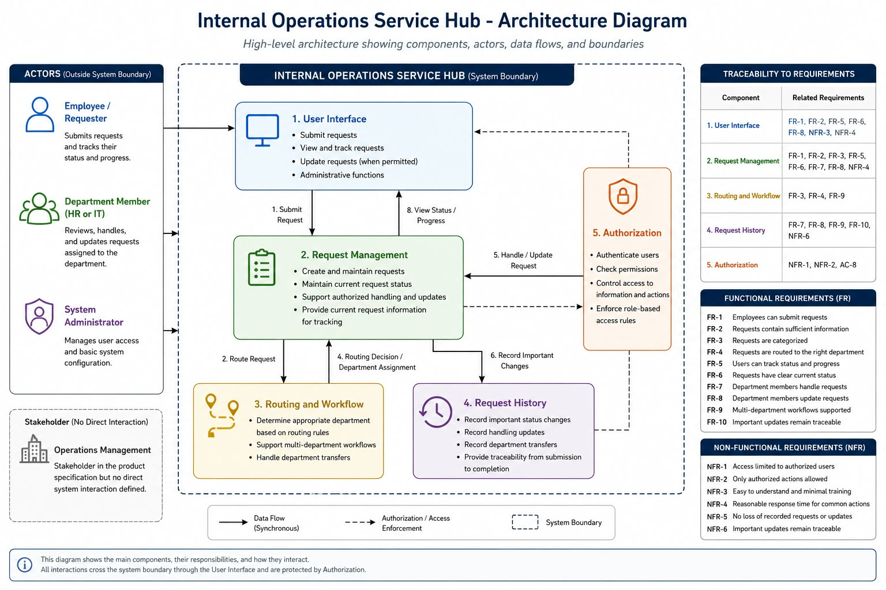

# Internal Operations Service Hub - Architecture

**Student Name: SINDY TAUK**

## 1. Purpose and Scope

This architecture defines the main design of the Internal Operations Service Hub based on the requirements in `product-spec.md`.

The system supports employees in submitting internal service requests, routing them to the appropriate department, allowing authorized department members to handle them, and tracking requests until completion.

This document focuses on system responsibilities, components, flows, boundaries, reliability, and major architecture decisions. Implementation details are outside the current scope.

## 2. Requirements Driving the Design

The architecture is driven by the following requirements from the product specification:

- Employees must be able to submit internal service requests.
- Requests must be categorized and routed to the appropriate department.
- Authorized department members must be able to view, handle, and update assigned requests.
- Employees must be able to track the status and progress of their submitted requests.
- The system must support workflows involving more than one department when required.
- Important request updates and status changes must remain traceable.
- Access to request information and actions must be restricted to authorized users.
- Successfully recorded requests and updates should not be lost during normal operation.

## 3. Actors and System Boundary

### Actors

- **Employee / Requester:** Submits internal service requests and follows their status and progress.
- **Department Member (HR or IT):** Reviews, handles, and updates requests assigned to the department.
- **System Administrator:** Manages user access and basic system configuration when required.

Operations Management is a stakeholder in the product specification, but no direct system interaction is currently defined for it.

### System Boundary

The Internal Operations Service Hub is responsible for receiving requests, managing their lifecycle, routing them to the appropriate department, controlling authorized access, and maintaining important request history.

Employees, department members, and system administrators interact with the hub but remain outside the system boundary.

## 4. Components and Responsibilities

### User Interface

Provides the interaction point for employees, department members, and system administrators.

It allows authorized users to submit requests, view request information, update requests when permitted, and track request progress.

**Why it exists:** The product specification requires users to interact with the system to submit, handle, update, and track requests.

### Request Management

Manages each internal service request from submission until completion.

It is responsible for:

- creating and maintaining requests;
- maintaining the current request status;
- supporting authorized handling and updates;
- providing current request information for tracking.

**Why it exists:** FR-1, FR-6, FR-7, and FR-8 require requests to be submitted, handled, updated, and tracked.

### Routing and Workflow

Determines the appropriate department for a request according to defined routing rules and supports workflows involving more than one department.

**Why it exists:** FR-3, FR-4, and FR-9 require request categorization, routing, and multi-department workflows.

The exact routing rules and department order are not defined because they remain unknown in the product specification.

### Request History

Maintains important status changes, handling updates, and department transfers.

**Why it exists:** FR-10 and NFR-6 require request activity to remain traceable from submission until completion.

### Authorization

Controls access to protected request information and actions.

**Why it exists:** NFR-1, NFR-2, and AC-8 require access and modifications to be limited to authorized users.

## 5. External Dependencies

No specific external system dependency is confirmed by the current product specification.

The specification assumes that employees have an identity or account to access the system, but it does not define whether this is provided by an external identity service. Therefore, no external identity service is introduced as a confirmed dependency in the current architecture.

## 6. Important Data Flows

### Standard Request Flow

1. An employee submits an internal service request through the User Interface.
2. The system checks that the user is authorized to perform the action.
3. Request Management records the request and its current state.
4. Routing and Workflow determines the appropriate department according to the defined routing rules.
5. The request becomes available to authorized members of that department.
6. An authorized department member handles the request and updates its status or progress.
7. Important changes are recorded in Request History.
8. The employee can view the current status and progress of the request.
9. The process continues until the request reaches a completed state.

### Multi-Department Request Flow

When a request requires more than one department, Routing and Workflow supports moving the request between the required departments according to the defined workflow.

Request Management maintains the current state, while Request History records important transfers and updates.

The exact order between departments is not defined because it remains an unknown in the product specification.

## 7. Trust and Authorization Boundaries

The main trust boundary exists between users and the Internal Operations Service Hub.

Users are not automatically trusted to access or modify request information. Authorization must be checked before protected information is accessed or changed.

- Employees may submit requests and view requests they are authorized to access.
- Department members may view and handle requests only when they have the required permission.
- Status updates and department transfers may only be performed by authorized users.
- Administrative actions must be restricted to users with the appropriate administrative permission.

These boundaries support NFR-1, NFR-2, and AC-8 from the product specification.

## 8. Failure Scenarios

### Request Submission Failure

If a request cannot be recorded, the system must not confirm the submission as successful. The employee should receive a clear failure result and be able to retry.

### Routing Failure

If a recorded request cannot be routed, it must remain recorded and traceable. It must not be shown as successfully assigned until routing succeeds.

### Status Update Failure

If a status update cannot be recorded, the previous confirmed status remains valid. The failed update must not be shown as successful.

### Department Transfer Failure

If a request cannot be transferred to the next department, its last confirmed state remains valid and traceable. The transfer must not be considered complete until it succeeds.

### Request Tracking Failure

If current request information cannot be retrieved reliably, the system must not present uncertain information as the confirmed current state.

## 9. Reliability and Scalability

### Reliability

Successfully recorded requests and important updates should remain available during normal system operation.

When an operation fails, the request should remain in its last confirmed state rather than creating an unclear or falsely completed state.

This supports NFR-5 and NFR-6 from the product specification.

### Scalability

The system is designed for internal company use, and the current specification does not require internet-scale traffic.

The architecture should support reasonable growth in employees, departments, and requests without changing its main responsibilities.

Additional distributed infrastructure or unnecessary microservices are not introduced because the current requirements do not justify that complexity.

## 10. Communication Decisions

Core user actions use synchronous communication when an immediate confirmed result is required.

This includes:

- submitting a request;
- updating a request status;
- confirming a department transfer.

A successful result should only be shown after the required action has been confirmed.

The current product specification does not confirm a requirement for background processing or notifications. Therefore, asynchronous messaging is not introduced at this stage.

## 11. Major Architecture Decisions

### Decision 1 - Keep the Architecture Minimal

Only components and responsibilities required by the current product specification are included.

**Driven by:** The product scope, constraints, and non-goals defined in `product-spec.md`.

### Decision 2 - Separate Request Management from Routing and Workflow

Request Management handles the request lifecycle and current state. Routing and Workflow determines where a request should be handled and supports movement between departments.

**Driven by:** FR-4, FR-7, FR-8, and FR-9.

### Decision 3 - Maintain Request History

Important status changes, handling updates, and department transfers are recorded.

**Driven by:** FR-10, NFR-6, AC-7, and AC-9.

### Decision 4 - Enforce Authorization

Authorization is checked before protected request information is accessed or modified.

**Driven by:** NFR-1, NFR-2, and AC-8.

### Decision 5 - Do Not Introduce Unconfirmed External Dependencies

No external service is treated as required unless it is confirmed by the product specification.

**Driven by:** The assumption that employees have an identity or account, while the source of that identity remains undefined.

## 12. Traceability to the Product Specification

- **FR-1:** User Interface and Request Management
- **FR-2:** User Interface and Request Management
- **FR-3:** Request Management and Routing and Workflow
- **FR-4:** Routing and Workflow
- **FR-5 and FR-6:** User Interface, Request Management, and Authorization
- **FR-7:** Request Management and Request History
- **FR-8:** User Interface, Request Management, and Request History
- **FR-9:** Routing and Workflow and Request History
- **FR-10:** Request History
- **NFR-1 and NFR-2:** Authorization and trust boundaries
- **NFR-3:** User Interface responsibility and simple user-facing flows
- **NFR-4:** Direct communication for common user actions requiring a reasonable response time
- **NFR-5:** Reliability and failure handling
- **NFR-6:** Request History and traceable request flows

The architecture does not define exact request categories, statuses, approval rules, routing rules, role permissions, notification behavior, or multi-department ordering because these remain unknown in `product-spec.md`.

## 13. Architecture Diagram

The following diagram presents the high-level architecture of the Internal Operations Service Hub.

